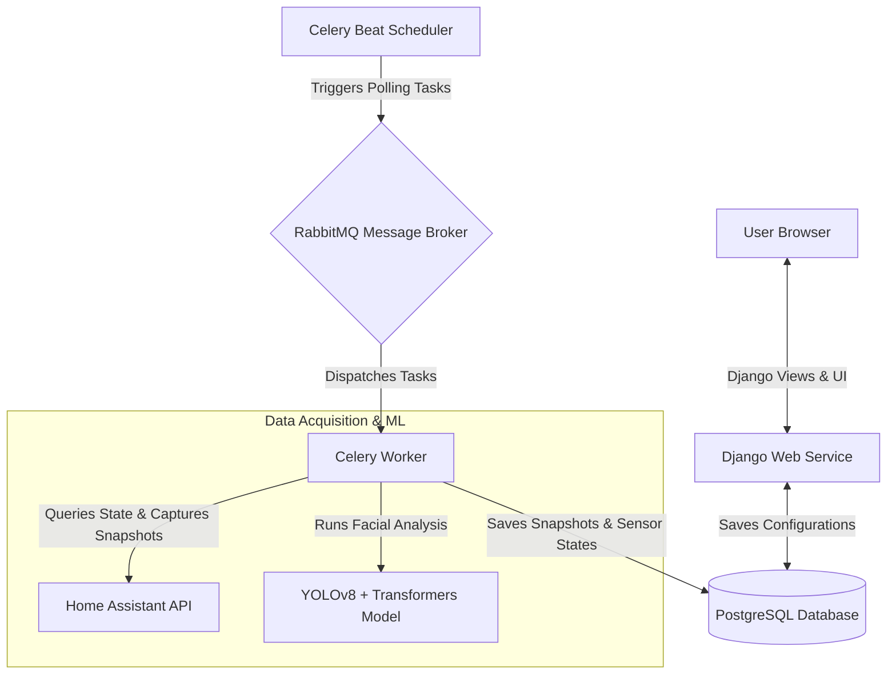

# SHERE - Smart Home Emotion Research Engine

SHERE (Smart Home Emotion Research Engine) is an advanced Django-based research framework designed to study the correlations between user emotional states and domestic environments. By integrating directly with Home Assistant (HA), SHERE captures real-time smart home device states (such as lighting levels, room temperatures, and media player activity) alongside user facial emotions analyzed from home cameras.

This data provides researchers and smart home enthusiasts with empirical logs to design and evaluate emotional-aware ambient intelligence and adaptive automation.

---

## 🌟 Key Features

*   **🔒 Secure Credentials Store**: Sensitive Long-Lived Access Tokens (LLAT) for Home Assistant are encrypted using symmetric Fernet encryption (`cryptography`) before being persisted in the database.
*   **🧠 Deep Learning Emotion Detection**: Leverages **HuggingFace Transformers** (`dima806/facial_emotions_image_detection`) and **YOLOv8** (`arnabdhar/YOLOv8-Face-Detection`) to perform high-fidelity face detection and emotion classification (Happy, Sad, Angry, Surprised, Fear, Disgust, Neutral) with confidence scores.
*   **⏱️ Distributed Periodic Polling**: Automated heartbeat checks driven by **Celery** and **Celery Beat** run every 30 seconds to query device states and camera frames in parallel, preventing UI blocking.
*   **📊 Unified Data Analysis Matrix**: A comprehensive dashboard showing historical poll cycles aligning camera snapshots with concurrent smart entity states.
*   **📥 CSV Exporter**: Export the unified database logs with a single click to perform data modeling, statistical correlation, or train predictive models.
*   **🔌 Plug-and-Play Configuration**: Add and edit cameras or entities dynamically via the configuration UI.

---

## 🏗️ System Architecture

The following diagram illustrates how SHERE orchestrates the web dashboard, background workers, databases, and the external Home Assistant API:



---

## 🛠️ Technology Stack

*   **Backend Framework**: [Django](https://www.djangoproject.com/)
*   **Task Queue & Scheduling**: [Celery](https://docs.celeryq.dev/) & [django-celery-beat](https://github.com/celery/django-celery-beat)
*   **Message Broker**: [RabbitMQ](https://www.rabbitmq.com/)
*   **Database**: [PostgreSQL 15](https://www.postgresql.org/)
*   **Computer Vision**: [OpenCV Headless](https://github.com/opencv/opencv-python)
*   **Deep Learning**: [PyTorch](https://pytorch.org/), [HuggingFace Transformers](https://huggingface.co/transformers/), & [YOLOv8](https://github.com/ultralytics/ultralytics)
*   **Cryptography**: [Fernet (Cryptography)](https://cryptography.io/)
*   **Containerization**: Docker & Docker Compose

---

## ⚙️ Database Schema & Models

SHERE maps the research data using a structured relational model:

### `HomeAssistantCredentials`
Stores the connection coordinates and authentication tokens.
*   `user`: Django Auth user owner.
*   `host` / `port`: Coordinates of the Home Assistant instance.
*   `encrypted_token` (Write-only): The access token encrypted using `cryptography.fernet`. Plaintext tokens are never stored directly.

### `PollCycle`
Acts as the central timeline heartbeat. Every periodic run generates a new `PollCycle` with a timestamp to group snapshots and entity states together.

### `Entity`
Defines the Home Assistant entities to track (e.g., `sensor.living_room_temperature`, `light.kitchen_lights`).
*   `entity_id`: The exact Home Assistant identifier.
*   `name`: A friendly name for display.
*   `location`: Physical room or area.
*   `unit_of_measurement`: Optional unit (e.g. `°C`, `%`).

### `EntityStatus`
A time-series entry representing the state of an `Entity` at a specific `PollCycle`.

### `Camera`
Defines registered cameras to query frames from.
*   `camera_id`: The exact Home Assistant camera entity identifier (e.g., `camera.living_room`).

### `CameraSnapshot`
Stores the image captured at a specific `PollCycle` alongside its analytical results.
*   `image`: Path to the saved image in Django's media storage.
*   `detected_emotion`: The primary emotion classification returned by the model.
*   `confidence_score`: A normalized value (0.0 to 1.0) indicating the model's prediction confidence.

---

## 💻 System Requirements

Before deploying SHERE, ensure your host environment meets the following minimum requirements:

*   **Software**: [Docker](https://www.docker.com/) with [Docker Compose](https://docs.docker.com/compose/)
*   **Architecture**: x86_64 / x64 CPU
*   **Processor**: Dual-core CPU (2 Cores minimum)
*   **Memory**: 4 GB RAM minimum
*   **Network & Connectivity**: Accessible Home Assistant instance with exposed REST API (and a valid Long-Lived Access Token)
*   **Optional GPU Acceleration**: An NVIDIA graphics card (e.g. RTX series) can be passed through to accelerate deep learning model inference. To enable GPU support:
    1. Install proper NVIDIA host drivers.
    2. Install `nvidia-container-toolkit` on the host machine.
    3. Uncomment the NVIDIA GPU `deploy` block in `docker-compose.yml` under the `celery_worker` service.

---

## 🚀 Quick Start & Installation

Ensure you have [Docker](https://www.docker.com/) and [Docker Compose](https://docs.docker.com/compose/) installed.

### 1. Start Services
SHERE uses a pre-built Docker image hosted on GitHub Container Registry (`ghcr.io/adrian-wozniak-wat/shere:latest`). Simply run:

```bash
docker compose up -d
```

This will automatically pull the image and run five background services:
*   `db`: PostgreSQL database server.
*   `rabbitmq`: The message broker queue.
*   `web`: The Django web portal (accessible at `http://localhost:8000`).
*   `celery_worker`: Background process handler carrying out API requests and deep learning tasks.
*   `celery_beat`: Cron scheduler dispatching tasks every 30 seconds.

> [!IMPORTANT]
> **Security Notice**: Creating a `.env` file is optional because fallback default values are built-in for zero-configuration startup. However, **for security reasons, it is strongly recommended to set custom environment variables locally** in production or non-isolated deployments.

#### Environment Variables

The following environment variables can be customized:

| Variable | Description | Default |
| :--- | :--- | :--- |
| `DB_USER` | PostgreSQL database user | `admin` |
| `DB_PASSWORD` | PostgreSQL database password | `admin123` |
| `DB_HOST` | Database host address | `127.0.0.1` |
| `RABBIT_USER` | RabbitMQ broker username | `guest` |
| `RABBIT_PASSWORD` | RabbitMQ broker password | `guest` |
| `ENCRYPTION_KEY` | Symmetric Fernet key for encrypting stored access tokens | Built-in default key |
| `APP_USER` | Initial Django admin username created on startup | `admin` |
| `APP_PASS` | Initial Django admin password created on startup | `admin123` |
| `EMOTION_MODEL_NAME` | Deep learning emotion classification model | `dima806/facial_emotions_image_detection` |
| `CELERY_WORKER_CONCURRENCY` | Celery worker process concurrency | `2` |
| `DOCKER_IMAGE` | SHERE container image registry path | `ghcr.io/adrian-wozniak-wat/shere:latest` |

#### Example `.env` File:

```env
# Database & Broker Credentials
DB_USER=custom_db_user
DB_PASSWORD=custom_db_password
RABBIT_USER=custom_rabbit_user
RABBIT_PASSWORD=custom_rabbit_password

# Secret Fernet Encryption Key
# Generate using: python3 -c "from cryptography.fernet import Fernet; print(Fernet.generate_key().decode())"
ENCRYPTION_KEY=your-custom-generated-fernet-key

# Application Superuser Credentials
APP_USER=custom_admin
APP_PASS=custom_admin_password

# Optional Performance & Image Settings
CELERY_WORKER_CONCURRENCY=2
DOCKER_IMAGE=ghcr.io/adrian-wozniak-wat/shere:latest
```

### 2. Create a Superuser (Optional/Manual)
The `web` container automatically creates a superuser on startup using `APP_USER` and `APP_PASS` (defaulting to `admin` / `admin123`). If you wish to manually create additional admin accounts, run:

```bash
docker compose exec web python src/manage.py createsuperuser
```

### 3. Verify the App Status
Access `http://localhost:8000` in your web browser, log in using your superuser credentials, navigate to the **Run** tab, and execute the connection diagnostic suite to verify API credentials, sensor bindings, and model availability.

---

## 📧 Scientific Support & Contact

The author can provide full support with software setup, deployment, and data collection, especially when it comes to scientific and research purposes.

Additionally, for Home Assistant installations that are exposed to the internet, the author can host the application on remote infrastructure and deliver the compiled research results.

* **Contact Email**: [adrian.wozniak@wat.edu.pl](mailto:adrian.wozniak@wat.edu.pl)
